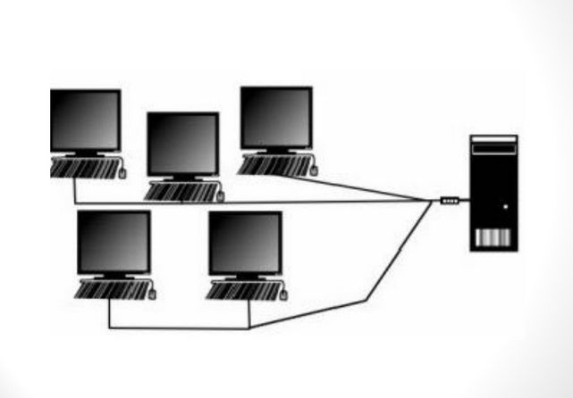

# Sistemas de Tempo Compartilhado

> AVISO - Queria pedir desculpas primeiramente, porque eu estou usando o padrao do teclado americado, ou seja, eu vou escrever paravras em acento.

Um Sistema Operacional de tempo compartilhado permite que muitos usuarios compartilharem o computador ao mesmo tempo. Como cada acao ou comando de um sistema de tempo compartilhado tende a ser curto, apenas um pequeno tempo de CPU eh necessario para cada usuario. 

Como o sistema alterna rapidamente de um usuario para o outro, cada usuario tem a impressao de que o sistema esta dedicado ao seu uso, enquanto na verdade o computador esta processando e executando tarefas de multiplos usuarios ao mesmo tempo.

Cada usuarios tem pelo menos um programa carregado na memoria (normalmente chamado de processo), ou seja, quando um processo executa, geralmente executa em um curto espaco de tempo ate terminar ou de precisar de uma operacao I/O.

A operacao de entrada/saida pode ser interativa, o dispositivo de saida poderia ser algum tipo de texto exibido pelo monitor e a entrada poderia vir de um teclado. Certos dispositivos I/O geralmente tem uma velocidade humana para ser executado (por exemplo a acao de uma pessoa digitar no teclado, isso tem um tempo de uma reacao humana), portando a CPU mesmo que por segundo ela ficaria "esperando" a acao dos dispositivos I/O terminarem, e eh ai onde o Sistemas Operacional passa CPU para atuar processando outra chamada de outro usuario.
